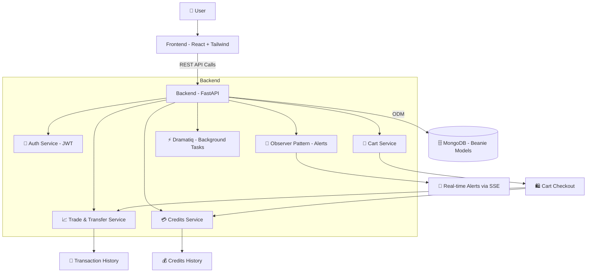

---

# 🪙 CryptoCortex

CryptoCortex is a modern **crypto trading and portfolio management platform** built with **FastAPI**, **MongoDB (Beanie ODM)**, and a **React frontend**.
It allows users to buy, sell, transfer, and manage cryptocurrencies while tracking balances, transaction history, and credits.

---

## 🚀 Features

* 🔑 **Authentication & Authorization**

  * JWT-based login, registration, and refresh tokens
  * Secure password hashing

* 📈 **Trading & Portfolio**

  * Buy & Sell crypto using trading symbols (e.g., `BTCUSDT`, `TRXUSDT`)
  * Transfer assets between users
  * Portfolio management with real-time updates

* 🛒 **Cart & Credits System**

  * Add multiple trades to a cart and checkout in bulk
  * Manage credits for deposits, withdrawals, and trade settlements
  * Full **credits history tracking**

* 🔔 **Real-time Alerts**

  * Low balance warnings
  * Suspicious transaction detection
  * Loan repayment deadline notifications (via **SSE + Observer Pattern**)

* 📊 **Admin & Analytics**

  * Transaction monitoring
  * User management
  * Trade analytics and reporting

---

## 📊 System Architecture

